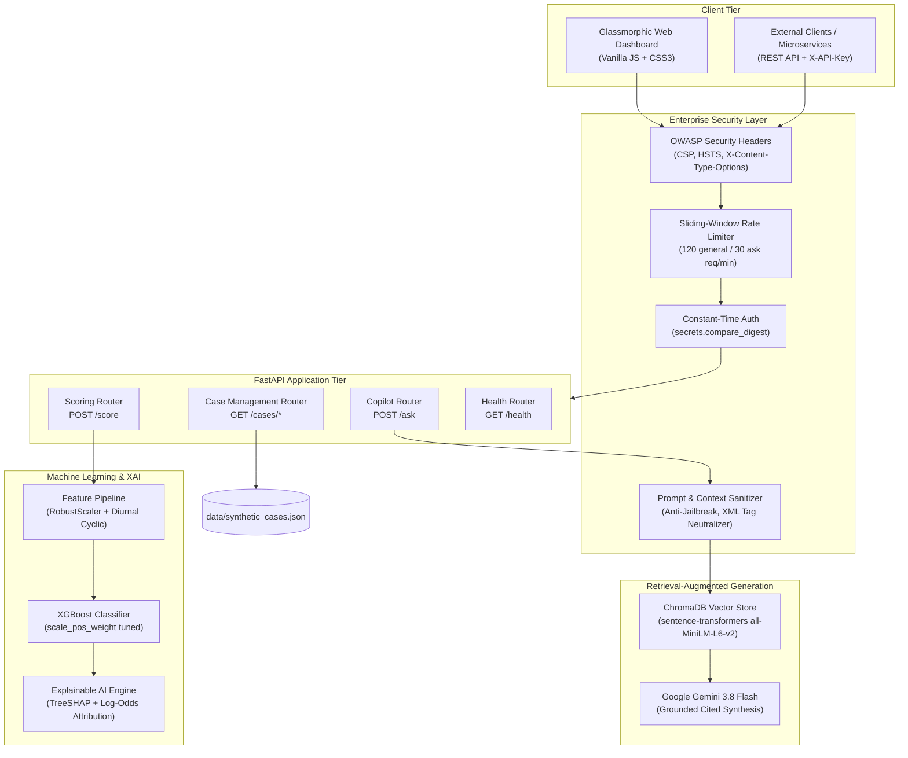

# 🔍 Fraud Investigation Copilot

A production-ready, full-stack fraud detection and investigation platform combining:
1. **Real-Time Fraud Scoring Engine** — XGBoost model with Explainable AI (TreeSHAP & log-odds forensic feature attributions)
2. **RAG Investigation Assistant** — Natural language Q&A over indexed fraud cases with cited answers (ChromaDB + Google Gemini)
3. **Case Management API** — Searchable, paginated repository of 200 forensic investigation records with mule network linking
4. **Interactive Glassmorphic Dashboard** — Modern dark cybersecurity UI with radial risk gauge, XAI cards, Copilot chat, and Case Explorer
5. **Enterprise Security Hardening** — OWASP security headers, sliding-window rate limiting, timing-safe API key authentication, and anti-prompt injection defenses

---

## 🏛️ System Architecture



---

## 🚀 Quick Start

### Prerequisites
* Python 3.11+
* Gemini API Key ([Get one free on Google AI Studio](https://aistudio.google.com/apikey))

### 1. Local Setup

```bash
# Clone the repository
cd fraud-copilot

# Create virtual environment and install dependencies
python -m venv .venv
.venv\Scripts\activate        # Windows
# source .venv/bin/activate   # Linux/macOS

pip install -r requirements.txt
```

### 2. Configure Environment

```bash
cp .env.example .env
# Edit .env and paste your GEMINI_API_KEY (optional for dev mode)
```

### 3. Build Artifacts & Start Service

```bash
# 1. Generate synthetic transactions & train model
python -m app.scoring.train

# 2. Generate 200 forensic case records
python -m app.data.synthetic_cases

# 3. Embed case records into ChromaDB
python -m app.rag.ingest

# 4. Launch FastAPI server with interactive dashboard
uvicorn app.main:app --host 127.0.0.1 --port 8000
```

### 4. Open the Interactive Dashboard
Navigate to **[http://localhost:8000/](http://localhost:8000/)** in your browser.
* **Risk Scoring Tab**: Test real-time transactions with preset scenarios (Normal, Anomaly, Structuring) and inspect live forensic feature attribution cards.
* **Investigation Copilot Tab**: Query indexed fraud cases in natural language with clickable citations.
* **Case Explorer Tab**: Filter, search, and inspect the case repository and linked mule account networks.

---

## 🐳 Docker Deployment

Run the complete platform inside a hardened container:

```bash
docker compose up --build
```
The container runs with non-root security context (`appuser`), internal health checks, and mounted persistent storage for models and vectors.

---

## 🛡️ Enterprise Security Features

| Defense | Specification | Purpose |
|---|---|---|
| **API Key Authentication** | `X-API-Key` with `secrets.compare_digest` | Prevents side-channel timing attacks; auto-enables dev pass-through if unconfigured |
| **OWASP Security Headers** | `nosniff`, `SAMEORIGIN`, `HSTS`, CSP | Blocks MIME sniffing, clickjacking, protocol downgrades, and XSS |
| **Sliding Window Rate Limiter** | 120 req/min general, 30 req/min for `/ask` | Protects endpoints against DoS floods and LLM token exhaustion |
| **Strict Schema Boundaries** | Pydantic v2 bounds & regex | Validates amounts ($0.00–$10M), PCA limits ($[-100, 100]$), query length ($\le 1000$) |
| **Anti-Prompt Injection** | XML Neutralization & Jailbreak Filter | Disarms raw `<` and `>` tags, strips ASCII control characters, filters prompt overrides |
| **Error Masking & Degradation** | Correlation ID tracking | Returns clean 500 with UUID trace ID; returns 503 instead of crashing on missing ML models |

---

## 📡 API Reference

Interactive OpenAPI documentation is available at **[http://localhost:8000/docs](http://localhost:8000/docs)**.

### `GET /health`
Public health probe for load balancers.
```bash
curl http://localhost:8000/health
# {"status": "ok"}
```

### `POST /score`
Scores a transaction and returns risk probability with Explainable AI attribution factors.
```bash
curl -X POST http://localhost:8000/score \
  -H "Content-Type: application/json" \
  -H "X-API-Key: your-api-key" \
  -d '{
    "transaction_id": "TXN-SIM-7842",
    "amount": 149.99,
    "time": 43200,
    "v1": 0.0, "v2": 0.0, "v3": 0.0, "v4": 1.38,
    "v5": 0.0, "v6": 0.0, "v7": 0.0, "v8": 0.0,
    "v9": 0.0, "v10": -0.17, "v11": 0.0, "v12": 1.07,
    "v13": 0.0, "v14": -0.14, "v15": 0.0, "v16": 0.0,
    "v17": 0.0, "v18": 0.0, "v19": 0.0, "v20": 0.0,
    "v21": 0.0, "v22": 0.0, "v23": 0.0, "v24": 0.0,
    "v25": 0.0, "v26": 0.0, "v27": 0.0, "v28": 0.0
  }'
```
**Response:**
```json
{
  "transaction_id": "TXN-SIM-7842",
  "risk_score": 0.000023,
  "flagged": false,
  "model_version": "xgboost-v1",
  "risk_factors": [
    {
      "feature": "scaled_amount",
      "contribution": 2.5825,
      "direction": "risk_increasing",
      "description": "Transaction amount deviation relative to typical consumer volume"
    },
    {
      "feature": "cos_time",
      "contribution": -0.1264,
      "direction": "risk_decreasing",
      "description": "Time of day: diurnal cyclical activity index (cos component)"
    }
  ]
}
```

### `POST /score/batch`
Vectorized high-throughput scoring of up to 100 transactions in a single pass.
```bash
curl -X POST http://localhost:8000/score/batch \
  -H "Content-Type: application/json" \
  -H "X-API-Key: your-api-key" \
  -d '{
    "transactions": [
      {"transaction_id": "TXN-B1", "amount": 149.99, "time": 43200, "v1": 0.0, ... "v28": 0.0},
      {"transaction_id": "TXN-B2", "amount": 850.00, "time": 43200, "v1": 0.0, ... "v28": 0.0}
    ]
  }'
```

### `POST /ask`
Natural language query against indexed forensic case records.
```bash
curl -X POST http://localhost:8000/ask \
  -H "Content-Type: application/json" \
  -H "X-API-Key: your-api-key" \
  -d '{"query": "Which UPI IDs are linked to mule accounts?", "top_k": 5}'
```

### `GET /cases/stats`
Returns aggregated metrics across all case records.
```bash
curl http://localhost:8000/cases/stats -H "X-API-Key: your-api-key"
```

### `GET /cases`
Paginated, filterable case list.
```bash
curl "http://localhost:8000/cases?status=escalated&page=1&page_size=10" -H "X-API-Key: your-api-key"
```

### `GET /cases/{case_id}`
Retrieves complete forensic details, complaint text, and linked mule accounts.
```bash
curl http://localhost:8000/cases/CASE-001 -H "X-API-Key: your-api-key"
```

### `PATCH /cases/{case_id}`
Updates case status, reassigns investigators, and appends timestamped forensic notes.
```bash
curl -X PATCH http://localhost:8000/cases/CASE-001 \
  -H "Content-Type: application/json" \
  -H "X-API-Key: your-api-key" \
  -d '{"status": "escalated", "investigator_notes": "Cross-bank mule network link confirmed.", "assigned_to": "INV-L2-105"}'
```

### `GET /cases/{case_id}/export`
Downloads a formatted JSON forensic dossier report attachment for cyber cell filing.
```bash
curl http://localhost:8000/cases/CASE-001/export -H "X-API-Key: your-api-key" -OJ
```

### `GET /metrics`
Public Prometheus text exposition format (v0.0.4) for monitoring and observability.
```bash
curl http://localhost:8000/metrics
```

---

## ⚙️ Configuration (`.env`)

| Variable | Default | Description |
|---|---|---|
| `GEMINI_API_KEY` | `""` | Google Gemini API key for live RAG synthesis |
| `MODEL_PATH` | `models/xgboost_fraud_v1.joblib` | Persisted model artifact path |
| `MODEL_VERSION` | `xgboost-v1` | Model release tag |
| `FLAG_THRESHOLD` | `0.5` | Classification threshold (auto-tuned during training) |
| `GEMINI_MODEL` | `gemini-3.8-flash` | Gemini model for grounded synthesis |
| `CHROMA_PERSIST_DIR` | `data/chroma_db` | ChromaDB vector store directory |
| `API_KEY` | `""` | Secret key for `X-API-Key` authentication (empty = dev mode) |
| `ALLOWED_ORIGINS` | `http://localhost:8000,http://127.0.0.1:8000` | Whitelisted CORS origins |
| `RATE_LIMIT_PER_MINUTE` | `120` | Max requests per minute on API endpoints |
| `ASK_RATE_LIMIT_PER_MINUTE` | `30` | Dedicated rate limit on LLM assistant endpoint |
| `ENABLE_SECURITY_HEADERS` | `true` | Enforce OWASP security headers |
| `MAX_QUERY_LENGTH` | `1000` | Input character cap for anti-DoS |
| `LOG_LEVEL` | `INFO` | Structured JSON log level |

---

## 🧪 Testing

The repository maintains a comprehensive automated test suite with 100% pass rate:

```bash
pytest tests/ -v --tb=short
```

```
tests/test_api.py ..................... PASSED
tests/test_rag.py ............ PASSED
tests/test_scoring.py ............. PASSED
tests/test_security.py ................. PASSED

============================= 64 passed in 15.14s =============================
```

---

## 📓 Exploratory Data Analysis

Explore the underlying dataset and feature transformations in the interactive Jupyter notebook:
* [`notebooks/01_fraud_eda_and_feature_engineering.ipynb`](file:///c:/Users/Soumain/.gemini/antigravity/scratch/fraud-copilot/notebooks/01_fraud_eda_and_feature_engineering.ipynb)

Covers class imbalance analysis, amount distribution comparisons, sinusoidal 24-hour diurnal clock projections, PCA correlation rankings, and Precision-Recall Curve (PR-AUC) evaluations.

---

## 📄 License

MIT
